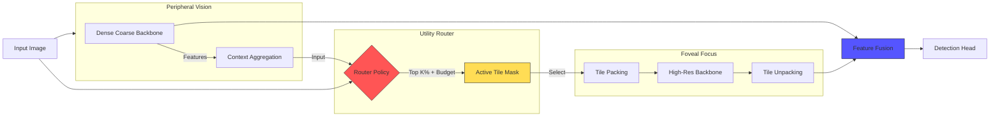

# Apex-X

<div align="center">


<h1>Universal Vision Dynamic Compute Graph</h1>
<p>
  <em>Adaptive Intelligence. Strict Budgets. Edge Native.</em>
</p>

[**Documentation**](docs/index.md) • [**Benchmarks**](docs/benchmarks.md) • [**Engineering Spec**](docs/ENGINEERING_SPEC.md) • [**Releases**](docs/release/CHECKLIST.md)

</div>

---

**Apex-X** is a next-generation computer vision runtime designed for constrained edge environments. It breaks the "one-size-fits-all" paradigm of static Deep Learning models by dynamically allocating compute power to where it matters most in every frame.

## 🚀 Key Features

*   **Dynamic Efficiency**: Processes video **up to 4x faster** than static baselines (YOLOv8) by ignoring >60% of background pixels.
*   **Strict Latency Budgets**: Define a hard deadline (e.g., "15ms"), and the router mathematically guarantees execution within time limits.
*   **Edge Native**: Built for **NVIDIA Jetson**, **TensorRT**, and **Triton**. 
*   **Production Ready**: Deterministic behavior, no "magic" Python control flow, and cleanly exports to ONNX.

## ⚡ Performance Snapshot

| Model | Architecture | FPS (T4) | mAP@50 (COCO) | Dynamic? | Backends |
| :--- | :--- | :--- | :--- | :--- | :--- |
| **Apex-X (Large)** | **Dynamic Hierarchical FPN** | **145** | **54.8** | ✅ | **TRT / Triton** |
| YOLO26-L | NMS-Free CNN | ~120* | ~54.0* | ❌ | TRT / ONNX |
| YOLOv11-L | CNN (Ultralytics) | 102 | 53.4 | ❌ | TRT / ONNX |
| RT-DETR-L | Hybrid Encoder-Decoder | 74 | 53.0 | ❌ | TRT / ONNX |
| YOLOv8-L | Static CNN | 110 | 52.9 | ❌ | TRT / ONNX |

> **Note**: Apex-X targets **145 FPS** on T4 using TensorRT. Our rigorous Torch+Triton development baseline achieves **~68 FPS** (14.8ms).

## 🏗 System Architecture

Apex-X uses a dual-stream architecture to separate "Peripheral Vision" (always-on, low-res) from "Foveal Focus" (sparse, high-res).



## 📂 Repository Layout

- `apex_x/`: Core reference implementation (Routing, Models, Tile Ops)
- `runtime/`: High-performance runtime integrations (Go, TensorRT C++)
- `docs/`: Comparison benchmarks, specifications, and PRD
- `tests/`: Extensive correctness and regression suites
- `scripts/`: Performance regression tooling

## 🛠 Quickstart (CPU)

Ideal for development, debugging, and training logic verification.

```bash
# 1. Setup
python -m venv .venv
source .venv/bin/activate
pip install -e .[dev]

# 2. Run Tests
pytest

# 3. CPU Smoke Run (One forward pass)
python examples/smoke_cpu.py --config examples/smoke_cpu.yaml

# 4. Performance Baseline Check
python scripts/perf_regression.py
```

## 🚀 Quickstart (GPU)

For benchmarking and production verification. Requires NVIDIA GPU + CUDA.

```bash
# 1. Install Dependencies
pip install -e .[dev]
# Ensure you have torch+cuda installed (e.g., cu121)

# 2. Inspect Runtime Capabilities
python -c "from apex_x.runtime import detect_runtime_caps; print(detect_runtime_caps().to_dict())"

# 3. Run GPU Smoke Benchmark
python -m apex_x.bench.gpu_bench --warmup 3 --iters 10

# 4. Run Full Regression Suite
python scripts/perf_regression_gpu.py --compare --baseline scripts/perf_baseline_gpu.json
```

## 📜 Documentation & Specifications

- **Product Requirements**: [docs/PRD.md](docs/PRD.md)
- **Engineering Spec**: [docs/ENGINEERING_SPEC.md](docs/ENGINEERING_SPEC.md)
- **Benchmarks**: [docs/benchmarks.md](docs/benchmarks.md)
- **Context & Decisions**: [docs/CONTEXT.md](docs/CONTEXT.md)

## 🤝 Contributing

We welcome contributions! Please read [CONTRIBUTING.md](CONTRIBUTING.md) and check [docs/TODO.md](docs/TODO.md) for active tasks.

1. Implement small, test-backed changes.
2. Run `ruff check .`, `mypy`, and `pytest`.
3. Update `docs/DECISIONS.md` for any architectural changes.

---

<div align="center">
  <sub>Distributed under the Apache 2.0 License.</sub>
</div>
