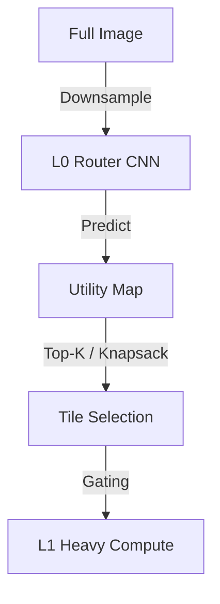

# Algorithm & Mathematics

Apex-X is built on **Utility-Based Dynamic Routing**. Instead of processing every pixel with equal compute, we treat feature computation as an economic resource allocation problem.

## Core Equation

The goal is to maximize the total utility $U$ of selected tiles subject to a compute budget $B$.

$$
\text{maximize} \sum_{i \in \text{Tiles}} u_i \cdot x_i \quad \text{subject to} \quad \sum_{i \in \text{Tiles}} c_i \cdot x_i \le B
$$

Where:
- $x_i \in \{0, 1\}$ is the binary decision to process tile $i$ at high resolution.
- $u_i$ is the predicted **utility** (information gain) of tile $i$.
- $c_i$ is the **cost** (latency) of processing tile $i$.
- $B$ is the total latency budget.

## Routing Mechanism

### 1. Coarse Estimation (L0)
The image is first processed by a lightweight "Router" (L0) running at 1/16th or 1/32nd resolution. 
The router outputs a utility map $\hat{U}$.

### 2. Dual-Variable Budget Controller
To solve the knapsack problem differentiably during training, we use Lagrange multipliers.
We introduce a dual variable $\mu$ (shadow price of compute).

$$
\mathcal{L} = \sum (u_i - \mu c_i) \cdot x_i + \mu B
$$

- If $\mu$ is high, compute is expensive $\to$ Select fewer tiles.
- If $\mu$ is low, compute is cheap $\to$ Select more tiles.

During inference, we can fix $\mu$ (simplified greedy) or dynamically adjust it (PID controller) to hit strict timing guarantees.

## Hierarchical Tile Coding

Apex-X uses a recursive tiling scheme (Quadtree-like) to handle scale.

- **Level 0 (Root)**: 32x32 regions.
- **Level 1 (Fine)**: 16x16 regions.

If a Level 0 tile has very high utility, it can be "split" into four Level 1 tiles for finer-grained decision making.

## Training Objective

The model learns utility $u_i$ via **distillation** from a heavy Teacher model.
The Teacher sees the full image. The Student (Apex-X) tries to select tiles such that its features match the Teacher's features in the important regions.

$$
L_{\text{total}} = L_{\text{task}} + \lambda_{\text{distill}} L_{\text{distill}} + \lambda_{\text{budget}} L_{\text{budget}}
$$
