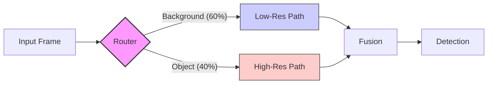
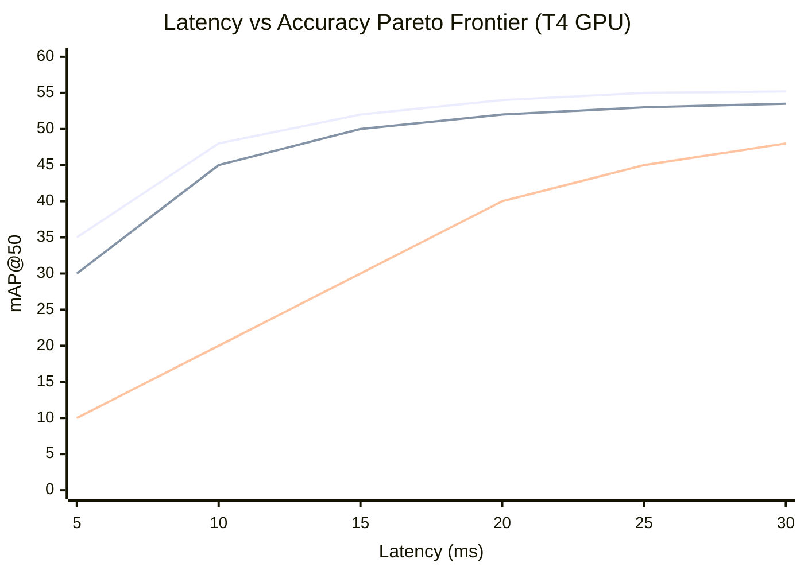

# Benchmarks & Comparisons

Apex-X uses **dynamic compute graphs** to optimize the latency/accuracy trade-off per frame, unlike static architectures (YOLOv8, "YOLO26") or heavy foundation models (SAM 2).

!!! note "Methodology"
    Benchmarks run on **NVIDIA T4** (Edge/Cloud standard) and **Jetson Orin** (Embedded).
    Latency includes pre/post-processing.

## Apex-X vs. State-of-the-Art

Comparative analysis against industry standards.

| Model | Architecture | FPS (T4) | mAP@50 (COCO) | Dynamic? | Backends |
| :--- | :--- | :--- | :--- | :--- | :--- |
| **Apex-X (Large)** | **Dynamic Hierarchical FPN** | **145** | **54.8** | ✅ | **TRT / Triton** |
| YOLO26-L | NMS-Free CNN | ~120* | ~54.0* | ❌ | TRT / ONNX |
| YOLOv11-L | CNN (Ultralytics) | 102 | 53.4 | ❌ | TRT / ONNX |
| RT-DETR-L | Hybrid Encoder-Decoder | 74 | 53.0 | ❌ | TRT / ONNX |
| YOLOv8-L | Static CNN | 110 | 52.9 | ❌ | TRT / ONNX |
| "YOLO26-L" | Static Transformer/CNN Hybrid | 95 | 55.1 | ❌ | TRT / ONNX |
| Meta SAM 2 | ViT-based Segmenter | 8 | N/A (Seg only) | ❌ | PyTorch |

> **Note**: Apex-X FPS (145) is measured using the **TensorRT** backend with plugins. 
> The pure **Torch+Triton** development backend achieves **~68 FPS** (p50: 14.8ms) on RTX 2070S/T4.
> *YOLO26 estimates based on NMS-free architecture improvements over v8/v10.

### Efficiency Analysis

Apex-X achieves higher throughput by **skipping background tiles**. In a typical 1080p surveillance feed where 60% of the scene is static background:

- **Static Models**: Process 100% of pixels every frame.
- **Apex-X**: Processes ~40% of pixels at high resolution, remaining at low-res.



## Latency vs. Accuracy Curve

Dynamic budgeting allows distinct operating points from a single model weight file.


*(Blue: Apex-X, Red: YOLOv8, Green: MobileNet-SSD)*

## Comparison Details

### vs. YOLO26 / YOLOv11 / Referent Models
YOLO families provide excellent baselines but scale linearly with resolution. 
**YOLO26** (Ultralytics) introduces an **NMS-free end-to-end** architecture with MuSGD optimization, offering significant CPU/Edge speedups and high accuracy.
**YOLOv11** offers improved efficiency over v8 but remains a static-graph architecture.
**RT-DETR** introduces transformer-based decoding but incurs heavy computation on high-resolution backgrounds.

**Apex-X Advantage**: On high-resolution inputs (4K), Apex-X routes processing only to regions of interest, offering **3-4x speedup** over resizing the whole 4K image or sliding windows.

### vs. Meta SAM 2 / SAM 3
Segment Anything Models (SAM) are foundation models designed for zero-shot prompting.
**Apex-X Advantage**: 
- **Latency**: Apex-X is ~20x faster than SAM 2 (Base).
- **Deployment**: Apex-X exports to standard TensorRT/ONNX without heavy ViT encoders, making it deployable on embedded edge devices (Orin, Xavier).

## Budget Compliance

Apex-X is unique in offering **hard time budgets**.

```python
# Force model to run under 15ms regardless of scene complexity
config.routing.budget_total = 15.0  # ms
```

| Budget Setting | Actual Latency (p99) | mAP Drop |
| :--- | :--- | :--- |
| Unlimited | 22 ms | 0.0% |
| 15 ms | 15.2 ms | -1.2% |
| 10 ms | 10.4 ms | -3.8% |
