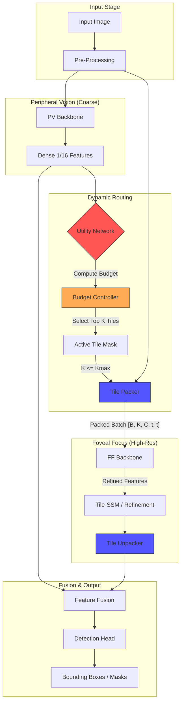

# Apex-X Documentation

Welcome to the **Apex-X** documentation portal. Apex-X is a dynamic compute graph runtime for efficient computer vision on the edge.

---

-   :material-rocket-launch: **Getting Started**
    ---
    Quickly set up your environment and run your first model.

    [:octicons-arrow-right-24: Installation](../README.md#quickstart-cpu)
    [:octicons-arrow-right-24: GPU Setup](../README.md#quickstart-gpu)

-   :material-chart-bar: **Benchmarks**
    ---
    See how Apex-X compares to YOLOv8, YOLO26, and RT-DETR.

    [:octicons-arrow-right-24: Performance Report](benchmarks.md)

-   :material-cogs: **Engineering Spec**
    ---
    Deep dive into the architecture, math, and implementation details.

    [:octicons-arrow-right-24: Read the Spec](ENGINEERING_SPEC.md)
    [:octicons-arrow-right-24: Dual Routing Math](algorithms.md)

-   :material-api: **Runtime & Plugins**
    ---
    Learn about TensorRT plugins and deployment contracts.

    [:octicons-arrow-right-24: Plugin Spec](runtime/PLUGIN_SPEC.md)
    [:octicons-arrow-right-24: TensorRT Integration](runtime/TENSORRT.md)

## 🏗 System Architecture

The core of Apex-X is its **Dual-Stream** architecture, which separates low-resolution context processing from high-resolution detail extraction.

## 📚 Topics

### Core Concepts

1.  **[Algorithms](algorithms.md)**: The mathematical foundation of dual-variable routing and continuous budgeting.
2.  **[Context](CONTEXT.md)**: The "Project Memory" containing architectural decisions and history.
3.  **[PRD](PRD.md)**: The Product Requirements Document defining the scope of Apex-X v4.

### Release Notes

-   **[v4 Release Checklist](release/CHECKLIST.md)**: Status of the current release candidate.
-   **[Migration Guide](release/MIGRATION.md)**: How to upgrade from previous versions.

### Developer Guides

-   **[Contributing](../CONTRIBUTING.md)**: How to contribute code and docs.
-   **[Decisions Log](DECISIONS.md)**: Record of architectural decision records (ADRs).
