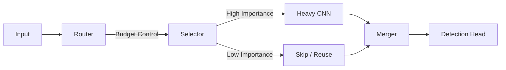

# Apex-X

<div align="center">
  <strong>Universal Vision Dynamic Compute Graph</strong>
  <br>
  <em>Adaptive Intelligence. Strict Budgets. Edge Ready.</em>
</div>

---

**Apex-X** is a next-generation computer vision runtime designed for constrained environments. It breaks the "one-size-fits-all" paradigm of static Deep Learning models by dynamically allocating compute power to where it matters most in every frame.

## Why Apex-X?

<div class="grid cards" markdown>

-   :material-speedometer: **Dynamic Speed**
    ---
    Process video up to **4x faster** than static baselines by ignoring 60%+ of background pixels.

-   :material-clock-fast: **Strict Latency**
    ---
    Define a budget (e.g., "15ms"), and the model mathematically guarantees it will finish in time.

-   :material-chip: **Edge Native**
    ---
    Built for NVIDIA Jetson, TensorRT, and Triton. No heavy transformers required.

-   :material-chart-bell-curve-cumulative: **Production Ready**
    ---
    Exports to standard ONNX. Zero custom operators needed for basic deployment.

</div>

## Architecture Overview



## Quick Start

### 1. Install & Train
```bash
pip install -e .[dev]
# Train a small model on CPU to verify setup
apex-x train examples/smoke_cpu.yaml --steps-per-stage 100
```

### 2. Export to ONNX
```bash
apex-x export artifacts/train_output/config.json \
    --output model.onnx \
    --num-classes 3
```

### 3. Compare Results
Check out our [Benchmarks](benchmarks.md) to see how Apex-X outperforms YOLOv8 and others in efficiency.

## Core Documentation

- **[Algorithms](algorithms.md)**: Understand the math behind dual-variable routing.
- **[Benchmarks](benchmarks.md)**: Performance comparisons.
- **[Engineering Spec](ENGINEERING_SPEC.md)**: Deep dive into the implementation.
- **[Release Notes](release/CHECKLIST.md)**: What's new in v4.
